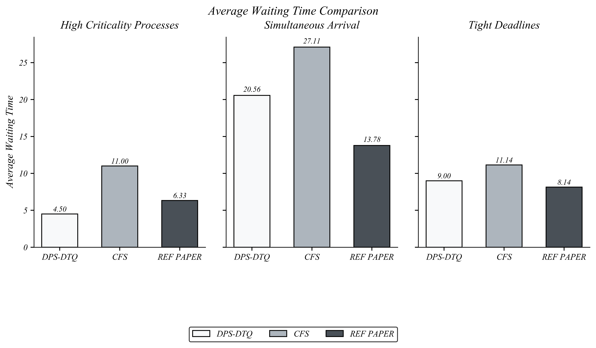

# Adaptive Priority Scheduler 
### Formerly DPS-DTQ (Dynamic Process Scheduling Dynamic Time Quantum)<br>
This repository presents an **Adaptive Priority Scheduler (DPS-DTQ)** that dynamically adjusts **priority** and **time quantum** for processes.  
It is compared against:  
- **Completely Fair Scheduler (CFS)** (baseline Linux-inspired scheduler)  
- **Reference Paper Algorithm** (SRPT + adaptive quantum approach from research paper)  

The project evaluates these schedulers across multiple benchmark scenarios with metrics like response time, turnaround time, waiting time, fairness, throughput, starvation, and load balancing efficiency.

---

## Project Structure

```bin/``` -> Compiled binaries (CFS, DPS-DTQ, REF_PAPER_ALGO)<br>
```inputs/``` -> Benchmark input process sets (periodic, aperiodic, deadlines, priorities, etc.)<br>
```outputs/``` -> Results in CSV for each scheduler<br>
```plots/``` -> Benchmark comparison plots (PNG)<br>
```src/``` -> Source code of the three schedulers<br>

---

## Algorithms Implemented

### 1. Adaptive Priority Scheduler (DPS-DTQ)
- **Dynamic Priority** = based on criticality, deadlines, waiting time (aging), and system priority.  
- **Dynamic Time Quantum (DTQ)** = adjusts based on priority and system load.  
- Balances real-time responsiveness with fairness.

### 2. Completely Fair Scheduler (CFS)
- Linux-inspired fair scheduling.  
- Uses **virtual runtime** weighted by process priority (nice value equivalent).  
- Ensures proportional fairness.

### 3. Reference Paper Algorithm
- **Shortest Remaining Processing Time (SRPT)** inspired.  
- Adaptive quantum = mean + median of burst times.  
- Prioritizes efficiency and fairness.

---

## Benchmarks & Evaluation

The schedulers are tested on multiple input scenarios:  
- High criticality processes  
- Simultaneous arrivals  
- Tight deadlines  
- Long burst times  
- Varying priorities  
- Periodic and aperiodic workloads  
- Extreme stress cases  

### Metrics Evaluated:
- Average Response Time  
- Average Turnaround Time  
- Average Waiting Time  
- Fairness Index (Jain’s Index)  
- Load Balancing Efficiency  
- Starvation Count  
- Throughput  

---

## Results

All plots are available in [`plots/`](./plots).  
Below are the key benchmark results:

### 🔹 Average Response Time


### 🔹 Average Turnaround Time


### 🔹 Average Waiting Time


### 🔹 Fairness Index


### 🔹 Load Balancing Efficiency


### 🔹 Starvation Count


### 🔹 Throughput


---

## How to Run

Compile all schedulers:
```bash
cd src
gcc DPS-DTQ.c -o ../bin/DPS-DTQ
gcc CFS.c -o ../bin/CFS
gcc reference-paper-algo.c -o ../bin/REF_PAPER_ALGO
```

## Key Findings

- **Adaptive Priority Scheduler** performs best in terms of **turnaround time, waiting time, and throughput** under high criticality workloads.  
- **CFS** ensures the highest **fairness** across most scenarios.  
- **Reference Paper Algorithm** shows balanced performance but struggles with starvation in some cases.  
- **Adaptive Priority Scheduler** adapts well to **real-time constraints**, while **CFS** remains optimal for fairness.  
